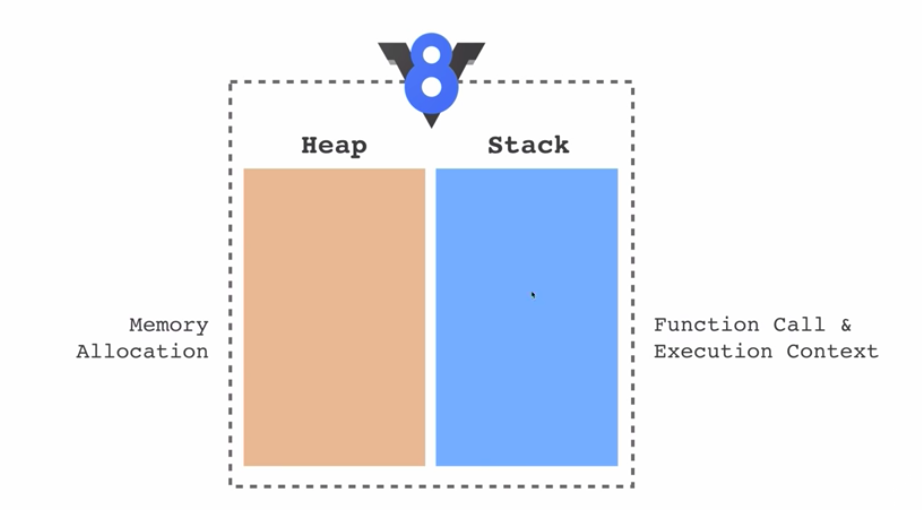
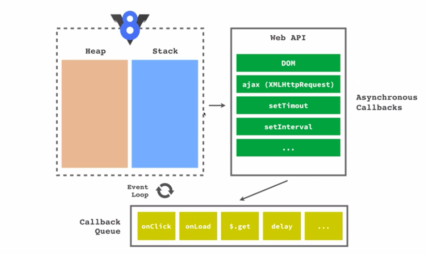

## Outline
1. JSON (`Javascript Object Notation`)
2. Synchronous dan asynchronous proccess 
    - Konsep
    - Analogi
    - Code dan aplikasinya
3. Callback 
    - Konsep
    - aplikasi pada synchronous dan asynchronous (STO)
4. fsReadFile 

<br><br>

## JSON

- tipe file yang biasa digunakan untuk pertukaran data (selain csv)
- bentuknya mirip dengan `array of object`
- tipe data `undefined` tidak diperbolehkan 🙅‍♂️

```js
[
    {
        "id": 1,
        "name": "ayu sudi",
        "point": {
            "math" : [90,100,80],
            "science" : [70, 90, 100]
        },
        "status": true
    },
    {
        "id": 2,
        "name": "devita",
        "point": {
            "math" : [90,100,80],
            "science" : [100, 90, 100]
        },
        "status": true
    }
]
```

## Synchronous dan Asynchronous Process

- Synchronous  : proses akan dieksekusi setelah proses sebelumnya selesai (blocking)
<br>

- Asynchronous : proses akan dieksekusi meskipun proses sebelumnya belum selesai (non-blocking). 
<br>


`Kenapa butuh proses Async?`
- Agar aplikasi lebih responsif. Contoh: tombol masih merespon jika diklik meskipun proses klik tombol sebelumnya belum selesai.
- Handle proses yang memakan waktu. Contoh: Membaca data berukuran besar, menunggu data dari internet, dll

## Callback

- Fungsi yang digunakan sebagai parameter

contoh:
```js
function kereta(tujuan) {
    console.log(`sudah sampai di ${tujuan} dengan naik kereta`);
}

function pesawat(tujuan) {
    console.log(`sudah sampai di ${tujuan} dengan naik pesawat`);
}

function pergi(tujuan, cb) {
    console.log(`aku akan pergi ke ${tujuan} ...`);
    cb(tujuan)
}
```

`additional: v8 engine`
<br>

<br>

<br>
resource: http://latentflip.com/loupe/
