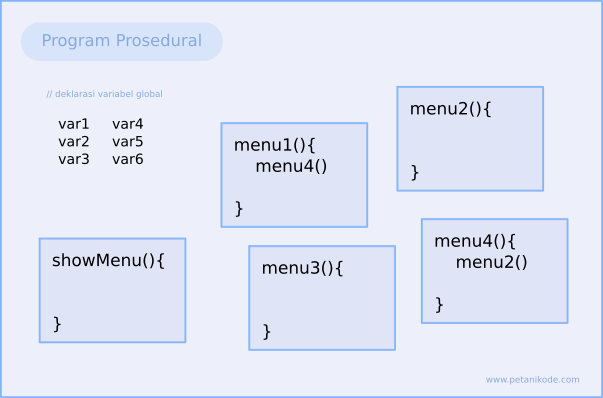
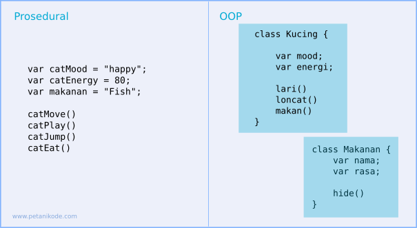

Outline:
- apa itu OOP ?
- kenapa menggunakan OOP dibandingkan object literal biasa ?
- apa itu class dan instance ?
- apa itu constructor pada sebuah class ?
- apa itu "this" ?
- apa itu method chaining (return this) ?
- pembacaan file pada node js menggunakan fsReadFileSync (baca doc nodejs)

<br><br><br>

**Latar Belakang**



Problem
1. Ada banyak variabel yang terasa `lebih enak` ditaruh di global tapi bukan best practice
2. Semakin besar program, semakin banyak function, semakin kompleks dan code sulit di maintain

**Apa itu OOP?**


`OOP` adalah paradigma pemrograman yang mendefinisikan design software dalam bentuk object  sesuai dengan keadaan nyata, bukan hanya kumpulan fungsi dan logika saja.



**OOP vs Object Literal**  => nanti dioper ke vscode 1-oop.js, study case agar mendapat kesimpulan sbb

OOP bersifat lebih dinamis, jika suatu saat ada penambahan property atau method, cukup ditambah di `cetakan` sedangkan jika di object literal harus ditambah satu persatu.

**Class, Instance, Contructor, This** 

Class : cetakan
Instance : hasil cetakan, proses mencetak disebut `instantiate`
Constructor : method yang akan otomatis dieksekusi ketika me-instantiate
This: representasi dari dirinya sendiri => akan didemokan

```js
class Hp {
    constructor(merk, color) {
        this.merk = merk
        this.color = color
    }
}
```

```js
let blackberry = new Hp('blackberry', 'purple')
console.log(blackberry);
```

yg harus didemokan di slide ini adalah: 
1. deklarasi class (hanya property)
2. proses instantiate
3. default paramater
4. this
5. deklarasi method (hanya instance method)
6. cara panggil method

**Method Chaining**

```js

let word = `selamat pagi`

word.split(' ').toUpperCase()   // script: secara tidak sadar kalian sudah pernah pakai. Lanjut didemoin cara bikinnya di OOP
```
```js
class Hp {
    constructor(merk, color, pulsa) {
        this.merk = merk
        this.color = color
        this.pulsa = pulsa
    }

    sendInfoSisaPulsa() {
        console.log(this.pulsa)
    }

    telp() {
        this.pulsa -= 10000
        return this
    }
}

let blackberry = new Hp('blackberry', 'purple', 100000)
console.log(blackberry);

blackberry.telp().sendInfoSisaPulsa()
```

**fsReadFileSync** => nanti dioper ke vscode untuk study case sambil membaca dokumentasi


